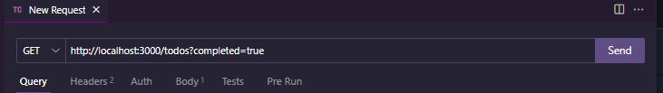

<h1>Simple To-Do Application</h1>
<h2>Powered by Node.js modules</h2>

<h3>Overview</h3>

A simple to-do application that stores data in a JSON file and logs actions in a txt file to keep what you do.  
This project is created in completion to the course: Applications Development 2.

<h3>Scope Functions</h3>

<ul>
    <li>Create to-do: Creates a task composed of Title and Task status</li>
    <li>Read to-do: Displays all of your current tasks stored</li>
    <li>Update to-do: Updates the task status of your task</li>
    <li>Delete to-do: Deletes a task to keep your record clean</li>
</ul>

<h2>Instructions</h2>

 I advise you to follow these how-to steps in order to install, run, and test the application successfully.

<h3>How to install</h3>

<ul>
    <li>In your CMD, go to your desired file location and run this command: 
         &nbsp; 
        <i> git clone https://github.com/Fourthhy/appdev2-midterm-project.git </i> 
    </li>
    <li>After cloning the repository, open your VsCode by entering this command: 
         &nbsp; 
        <i>code .</i>
    </li>

</ul>

<h3>How to run the server</h3>

<ul>
    <li>In your CMD or VsCode terminal, run the server by entering: 
         &nbsp; 
        <i>node server.js</i>
    </li>
</ul>

## Ways to test
### Creating a Task

1. While the server is running, head to the <b>Thunder Client</b>

2. Enter <b>http://localhost:3000/todos</b> and set the method to <b>POST</b>just like what is shown in the image:

3. Under the <b>Body</b> section, enter the <b>title</b> of your task, follow the format in the image:

4. Make sure to follow the format, and hit <b>Send</b> to send request

The step 4 should expectedly give you this response:

Also will enter your task in the <b>todos.json</b>:

Also will enter your log in the <b>logs.txt</b>:

### Reading a Task / Tasks

<b>Fetching All Tasks</b>

1. While the server is running, head to the <b>Thunder Client</b>

2. Enter <b>http://localhost:3000/todos</b> and set the method to <b>GET</b>just like what is shown in the image:

3. Click <b>Send</b> to send request and should expectedly give you this response

<b>Fetching A task</b>

1. In the same running environment, set the URL to <b>http://localhost:3000/todos/1</b>, replace 1 with any ID of task available, set the method to <b>GET</b> and hit <b>SEND</b>

Step 1 should expectedly give this response: 

<b>Fetching A completed task</b>

1. In the same running environment, set the URL to <b>http://localhost:3000/todos?completed=true</b>, set the method to <b>GET</b> and hit <b>SEND</b>

Step 1 should expectedly give this response: 

Why is it empty? because you haven't done anything silly!

### Noticed the differences?

The response you get from using <b>http://localhost:3000/todos</b> is enclosed in an array, meaning that is all the task stored in todos.json. However, when used <b>http://localhost:3000/todos/1</b> which targets a specific ID, the response returned is an object data type, meaning it returns only the target task.

But why using <b>http://localhost:3000/todos?completed=true</b> stores the result in an array? Because it fetches all of the task under the condition of being completed.

### Updating a Task

1. In the same running environment, set the URL to <b>http://localhost:3000/todos/1</b>, replace 1 with any ID of task available, set the method to <b>PUT</b>, just like what is shown in this image: 

2. Under the <b>Body</b> section, enter the <b>completed</b> key and update to <b>true</b>, follow the format in the image:

3. Click <b>Send</b> to send request and should expectedly give you this response

Repeat fetching the task using the <b>http://localhost:3000/todos?completed=true</b> to see if you completed anything

### Deleting a Task

1. In the same running environment, set the URL to <b>http://localhost:3000/todos/1</b>, replace 1 with any ID of task available, set the method to <b>DELETE</b>, just like what is shown in this image: 

2. Click <b>Send</b> to send request and should expectedly give you this response

### Feel free to explore! Made by:
## Fourthhy

